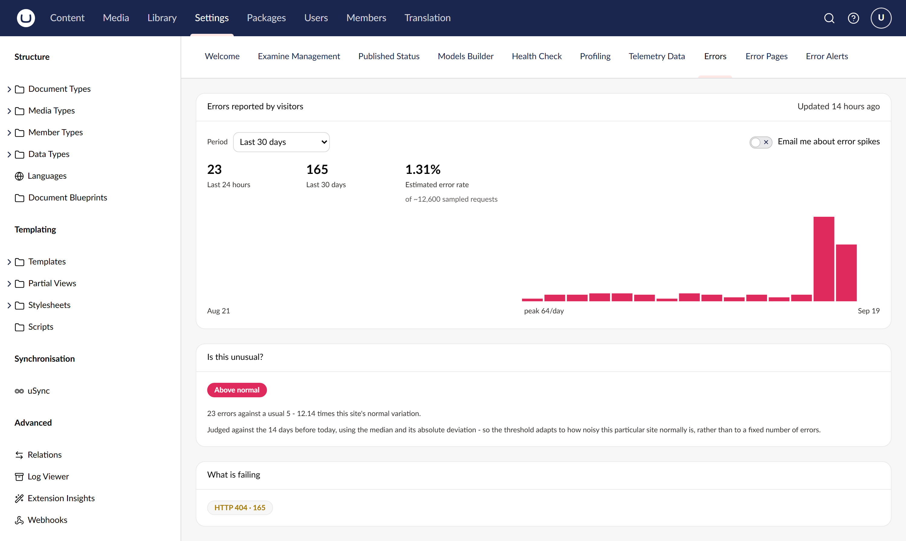

# Error Dashboard for Umbraco

**The errors your visitors hit, not the ones your server noticed.**

[](https://www.nuget.org/packages/Our.Umbraco.ErrorDashboard)
[](https://github.com/SteveVaneeckhout/Our.Umbraco.ErrorDashboard)

Collects 404s, 500s, TLS and DNS failures from visitors' browsers using Network Error Logging,
shows them on three Settings dashboards, and emails subscribed users when a site's error volume goes
abnormal — judged against the site's own history rather than a threshold you had to guess. Note that
NEL is Chromium-only, so every figure is a lower bound.

```bash
dotnet add package Our.Umbraco.ErrorDashboard
```

Requires Umbraco 18 and .NET 10.



## Documentation

- [Development setup](development.md)
- [How it works](architecture.md)
- [Full README](https://github.com/SteveVaneeckhout/Our.Umbraco.ErrorDashboard#readme)
- [Changelog](https://github.com/SteveVaneeckhout/Our.Umbraco.ErrorDashboard/blob/main/CHANGELOG.md)
- [Report an issue](https://github.com/SteveVaneeckhout/Our.Umbraco.ErrorDashboard/issues)

---

MIT licensed. Part of a set of three Umbraco 18 packages:
[Content Dashboard for Umbraco](https://github.com/SteveVaneeckhout/Our.Umbraco.ContentDashboard) · **Error Dashboard for Umbraco** (this one) · [TrueCopy for Umbraco](https://github.com/SteveVaneeckhout/Our.Umbraco.TrueCopy)
